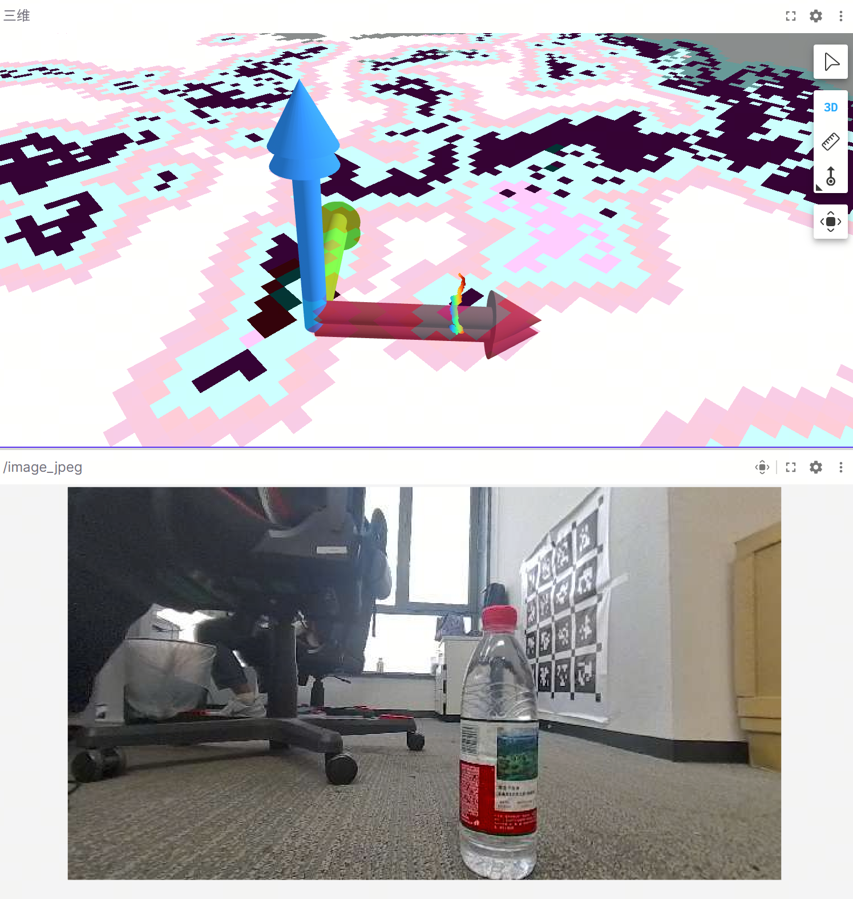

# AI Segmentation Mask PointCloud ROI Extractor

[English Version](README_en.md)  |  [中文版本](README.md)

## 1. 项目概述

AI Segmentation Mask PointCloud ROI Extractor是一个基于ROS2 Humble的功能包，专门用于从深度图中提取或过滤感兴趣区域（ROI）。它利用AI分割掩码技术，能够精确地从深度图或者点云中提取或者过滤出目标对象，为后续的机器人感知和决策提供感兴趣的点云或者深度图信息。

## 2. 核心功能

该功能包实现了以下核心功能：

- 使用标准ROS2节点实现
- 订阅深度图和AI检测信息，确保时间戳精确对齐
- 根据检测类别和置信度阈值从点云中提取或过滤ROI
- 深度过滤链路（过滤点云、深度图、掩码）：始终开启，输出供避障导航使用
- ROI点云链路（标准 PointCloud2，逐点携带 class_id / confidence / instance_id / rgb 调色板色；ROI分割叠加图）：受 enable_roi_extraction 门控，bring_up 按 run_semantic_map 下发——只有开启语义建图后才会运行（semantic_map 订阅 roi_cloud_topic）
- 常驻线程池并行处理帧（worker_threads），队列超限丢弃最旧帧（max_pending_frames）以约束延迟
- 支持动态参数调整
- 提供丰富的日志和调试信息

## 2. 目录结构

```
ai_seg_mask_pointcloud_roi_extractor/
├── include/
│   └── ai_seg_mask_pointcloud_roi_extractor/
│       ├── ai_seg_mask_pointcloud_roi_extractor.hpp  # 组件头文件
│       ├── params.hpp                                # 参数结构与声明/获取工具
│       ├── internal_types.hpp                        # 帧任务、线程池与丢弃最旧帧队列
│       └── depth_continuity.h                        # 深度连续性检查
├── src/
│   ├── ai_seg_mask_pointcloud_roi_extractor.cpp  # 组件主实现
│   ├── callback.cpp                              # 同步回调与任务投递
│   ├── pipeline.cpp                              # 深度过滤 / ROI / 叠加渲染三路处理管线
│   ├── depth_continuity.cpp                      # 深度连续性检查实现
│   ├── publish.cpp                               # 发布函数实现
│   ├── read_param.cpp                            # 参数与类别置信度读取
│   ├── set_dynamic_para.cpp                      # 动态参数处理
│   ├── time_stamp.cpp                            # 时间戳转换工具
│   └── time_sync_detect.cpp                      # 时间同步话题异常检测
├── launch/
│   ├── ai_seg_mask_pointcloud_roi_extractor.py   # 组件启动文件
│   ├── container.py                              # 组件容器装载
│   └── seg_mask_parser_config_params.py          # 配置解析器
├── config/
│   ├── descriptions/
│   │   └── ai_seg_mask_pointcloud_roi_extractor.yaml  # 参数配置描述
│   ├── model_classes_config.yaml                 # 深度过滤管线类别置信度阈值配置
│   └── model_classes_roi_config.yaml             # ROI提取管线类别置信度阈值配置
├── package.xml                         # 包定义文件
├── CMakeLists.txt                      # CMake构建文件
├── README.md                           # 中文文档
└── README_en.md                        # 英文文档
└── image                               # 图片文件夹
```

## 3. 依赖项

- **ROS2 Humble**：机器人操作系统
- **rclcpp**：ROS2 C++客户端库
- **rclcpp_components**：ROS2组件支持
- **sensor_msgs**：传感器消息类型
- **std_msgs**：标准消息类型
- **cv_bridge**：OpenCV与ROS图像转换
- **image_transport**：图像传输
- **OpenCV**：计算机视觉库
- **PCL (Point Cloud Library)**：点云处理库
- **ai_msgs**：自定义AI消息类型

## 4. 编译说明

### 4.1 创建工作空间

```bash
mkdir -p ./perception/src/
cd ./perception/src/
```

### 4.2 克隆代码库

```bash
git clone https://github.com/D-Robotics/ai_seg_mask_pointcloud_roi_extractor.git
git clone https://github.com/D-Robotics/ai_msgs.git
```

### 4.3 编译

源码编译依赖于地瓜提供的交叉编译工具链，详细流程参考链接：[5.1.3 源码安装 | RDK DOC](https://developer.d-robotics.cc/rdk_doc/Robot_development/quick_start/cross_compile)

```bash
# 先编译ai_msgs
bash ./robot_dev_config/build.sh -p X5 -s ai_msgs
# 再编译功能包
bash ./robot_dev_config/build.sh -p X5 -s ai_seg_mask_pointcloud_roi_extractor
```

## 5. 运行说明

### 5.1 使用Launch文件运行

```bash
# source 工作空间
source install/setup.bash

# 使用默认参数运行
ros2 launch ai_seg_mask_pointcloud_roi_extractor ai_seg_mask_pointcloud_roi_extractor.py

# 自定义参数运行
ros2 launch ai_seg_mask_pointcloud_roi_extractor ai_seg_mask_pointcloud_roi_extractor.py debug:=true log_level:=debug
```
NODE : 启动之前需要先启动双目以及yolov8-seg节点，确保深度图和检测信息能够被正常订阅。


## 6. 参数配置

### 6.1 配置文件说明

项目使用YAML文件进行参数配置，主要配置文件包括：

- **`config/descriptions/ai_seg_mask_pointcloud_roi_extractor.yaml`**：包含所有参数的详细描述、类型、默认值和单位
- **`config/model_classes_config.yaml`**：深度过滤管线类别的置信度阈值
- **`config/model_classes_roi_config.yaml`**：ROI 提取管线类别的置信度阈值（类名来自 YOLO 的 80 个 COCO 类别，见 tros_nav_workflow/bring_up/params/config/coco.list）；semantic_map 的类别白名单与该文件同源

解析阶段将两份类别配置合并为通用阈值（冲突取较低置信度），之后各管线再分别用专属阈值二次过滤。

### 6.2 参数说明

### 6.2 核心参数说明

| 参数名称 | 类型 | 默认值 | 描述 | 单位 |
|---------|------|-------|------|------|
| debug | bool | false | 是否启用调试模式，启用后会输出更详细的日志信息 | - |
| time_debug | bool | false | 是否启用查看各个模块的运行时间，启用后会输出更详细的日志信息 | - |
| topic_check | bool | false | 订阅话题存在性检测 | - |
| depth_image_topic | string | "/StereoNetNode/stereonet_depth" | 深度图订阅话题 | - |
| detect_info_topic | string | "/hobot_dnn_detection" | AI分割检测信息订阅话题 | - |
| class_info_topic | string | "/hobot_dnn_detection_info" | 类别信息订阅话题 | - |
| camera_info_topic | string | "/StereoNetNode/stereonet_depth/camera_info" | 相机信息订阅话题 | - |
| color_image_topic | string | "/StereoNetNode/origin_left_image" | 彩色图订阅话题 | - |
| filtered_mask_topic | string | "/filtered_depth_mask" | 过滤后的掩码发布话题 | - |
| filtered_depth_topic | string | "/filtered_depth_img" | 过滤后的深度图发布话题 | - |
| filtered_cloud_topic | string | "/filtered_depth_cloud" | 过滤后的点云发布话题 | - |
| roi_cloud_topic | string | "/roi/pointclouds" | ROI点云发布话题（标准 PointCloud2，逐点字段 class_id/confidence/instance_id/rgb；仅语义建图链路使用） | - |
| roi_visual_topic | string | "/roi/visual_depth_seg" | ROI分割叠加深度渲染图话题（bgr8，经 jpeg 编码后进 web 通道 2；空字符串禁用） | - |

### 6.3 配置参数说明

| 参数名称 | 类型 | 默认值 | 描述 | 单位 |
|---------|------|-------|------|------|
| confidence_threshold_file_path | string | "model_classes_config.yaml" | 类别置信度阈值文件路径 | - |
| queue_size | int | 10 | 消息同步队列大小，影响消息处理的实时性和稳定性 | - |
| allow_timestamp_deviation | double | 0.5 | 允许的时间戳偏差，超过此值的消息会被丢弃 | 秒 |
| min_depth | double | 0.0 | 最小深度过滤值，小于此值的点会被过滤 | 米 |
| max_depth | double | 5.0 | 最大深度过滤值，大于此值的点会被过滤 | 米 |
| dilate_iter_num | int | 1 | 掩码膨胀迭代次数，影响ROI区域的大小 | - |
| camera_width | int | 640 | 相机图像宽度，必须与实际输入图像一致 | 像素 |
| camera_height | int | 352 | 相机图像高度，必须与实际输入图像一致 | 像素 |
| log_level | string | "info" | 日志级别，可选值：debug、info、warn、error、critical | - |
| confidence_threshold_roi_file_path | string | "model_classes_roi_config.yaml" | ROI 提取管线类别置信度阈值文件路径 | - |
| erode_iter_num_roi | int | 1 | ROI 点云提取前对 ROI 专用语义掩码的腐蚀迭代次数（0=禁用；仅作用于 ROI/语义地图链路，深度过滤链路不受影响） | - |
| erode_extra_class_names | string | "chair" | 需要附加腐蚀的类别名单（逗号分隔，仅作用于 ROI/语义地图链路） | - |
| erode_extra_iter_num | int | 2 | erode_extra_class_names 类别的附加腐蚀迭代次数（0=禁用） | - |
| depth_continuity_check | bool | false | ROI 点云深度连续性检查（调试开关，默认关闭） | - |
| max_depth_diff | double | 0.3 | 深度连续性检查允许的邻域中位数最大深度差 | 米 |
| instance_depth_gate_tau | double | 0.3 | 实例级自适应百分位深度门控最小边距（0=禁用） | 米 |
| use_extractor | bool | false | 是否进行感兴趣区域提取；true:=提取，false:=过滤 | - |
| enable_roi_extraction | bool | true | ROI/语义建图链路总开关；false=跳过 ROI 提取与渲染任务（每帧省约 135ms 工作线程耗时），仅保留深度过滤链路。bring_up 按 run_semantic_map 下发 | - |
| worker_threads | int | 2 | 常驻工作线程数（上限 3，避免与 BPU 抢核） | - |
| max_pending_frames | int | 4 | 线程池待处理帧上限，超出丢弃最旧帧（需 ≥ 单帧任务数 3） | - |

### 6.4 动态参数

支持在运行时动态调整的参数：

- **debug**：启用/禁用调试模式
- **topic_check**：订阅话题存在性检测
- **log_level**：设置日志级别（debug/info/warn/error/critical）

```bash
# 动态调整日志级别
ros2 param set /seg_mask log_level debug

# 话题检测
ros2 param set /seg_mask topic_check true

# 动态启用调试模式
ros2 param set /seg_mask debug true
```

## 7. 消息格式

### 7.1 订阅消息

| 话题名称 | 消息类型 | 描述 |
|---------|---------|------|
| depth_image_topic | `sensor_msgs/msg/Image` | 深度图输入，编码：MONO16或TYPE_16UC1，单位：毫米 |
| detect_info_topic | `ai_msgs::msg::PerceptionTargets` | AI分割检测信息，包含目标类别、置信度、边界框和掩码数据 |
| class_info_topic | `ai_msgs::msg::PerceptionInfo` | 检测类别信息，包含所有可能的检测类别 |
| camera_info_topic | `sensor_msgs/msg/CameraInfo` | 相机参数信息，包含内参、畸变系数等 |
| color_image_topic | `sensor_msgs/msg/Image` | 彩色图像输入 |

### 7.2 发布消息

| 话题名称 | 消息类型 | 描述 |
|---------|---------|------|
| filtered_cloud_topic | `sensor_msgs/msg/PointCloud2` | 过滤后的点云，仅包含ROI区域的点云数据 |
| filtered_depth_topic【最终发布的话题】 | `sensor_msgs/msg/Image` | 过滤后的深度图，仅包含ROI区域的深度信息 |
| filtered_mask_topic | `sensor_msgs/msg/Image` | 过滤后的掩码，二值图像，1表示ROI区域，0表示非ROI区域 |
| roi_cloud_topic | `sensor_msgs/msg/PointCloud2` | ROI点云，逐点字段：x/y/z (float32)、class_id (int32)、confidence (float32)、instance_id (int32，帧内实例号)、rgb (uint32，0xAARRGGBB 打包)，供 semantic_map 构建语义地图 |
| roi_visual_topic | `sensor_msgs/msg/Image` | ROI分割叠加深度渲染图（bgr8：深度 JET 渲染 + ROI 掩码叠加） |

## 8. 工作流程

### 8.1 初始化阶段
- 创建ROS2节点和参数对象
- 声明和获取配置参数
- 初始化发布者和订阅者
- 通过read_param.cpp解析YAML配置文件中的类别置信度阈值

### 8.2 数据接收阶段
- 订阅相机信息和类别信息
- 使用message_filters实现深度图和检测信息的时间同步

### 8.3 参数配置解析
- 根据订阅的类别信息和配置文件设置目标检测参数
- 支持动态调整的参数配置

### 8.4 数据处理阶段
- 将ROS消息转换为OpenCV图像格式
- 解析检测信息生成分割掩码
- 对掩码进行膨胀处理
- 根据掩码过滤深度图
- 将深度图转换为点云
- 常驻线程池逐帧并行执行三路任务（深度过滤、ROI点云提取、ROI叠加渲染），队列超限丢弃最旧帧
- ROI链路：按类附加腐蚀与实例级自适应百分位深度门控去除边界伪影与径向拖尾噪声
- 零拷贝共享深度消息缓冲、MatPool 复用大图缓冲、掩码单遍生成

### 8.5 结果发布阶段
- 发布过滤后的深度图
- 发布过滤后的掩码图像
- 发布过滤后的点云
- 发布ROI点云（标准 PointCloud2）与ROI分割叠加渲染图（roi_visual_topic 非空时）

## 9. 注意事项

1. **时间同步**：深度图和检测信息必须时间戳对齐，否则会被跳过处理
2. **图像尺寸**：深度图和分割掩码的尺寸必须与配置的camera_width和camera_height一致
3. **深度单位**：默认假设深度图单位为毫米，转换为米进行处理
4. **类别配置**：model_classes_config.yaml（深度过滤）与 model_classes_roi_config.yaml（ROI提取）需要根据实际的AI模型类别进行配置（YOLO 的 80 个 COCO 类别，见 tros_nav_workflow/bring_up/params/config/coco.list）
5. **性能考虑**：处理大分辨率图像时可能需要调整队列大小和时间戳偏差参数

## 10. 性能优化

1. **调整队列大小**：根据系统性能和消息频率调整queue_size参数
2. **优化深度范围**：根据实际应用场景调整min_depth和max_depth参数，减少不必要的计算
3. **调整膨胀迭代次数**：根据分割掩码的质量调整dilate_iter_num参数

## 11. 调试方法

### 11.1 设置日志级别

```bash
# 运行时设置日志级别
ros2 launch ai_seg_mask_pointcloud_roi_extractor ai_seg_mask_pointcloud_roi_extractor.py log_level:=debug

# 动态调整日志级别
ros2 param set /seg_mask log_level debug

# 查看各个模块的运行时间
ros2 param set /seg_mask time_debug true
```

### 11.3 可视化 ROI 点云（foxglove / RViz）

`roi_cloud_topic` 输出标准 `sensor_msgs/msg/PointCloud2`，foxglove 3D 面板 / RViz 可直接订阅渲染，无需任何转换脚本。每个点自带 `rgb` 字段——调色板颜色与 semantic_map/object_ids 标记同源（semantic_map `config/cell_colors.list` 按白名单顺序分配，白名单之外的类别 id 按 HSV 兜底规则着色）：foxglove 把该消息的 **Color Mode 设为 RGBA**、RViz 用平色渲染即显示与语义地图一致的颜色；也可用 Color by field `class_id` 走内置色图。输出在相机光学坐标系下，foxglove 需勾选 /tf 与 /tf_static，或把面板固定坐标系设为该 frame。




### 11.2 检查参数

```bash
# 查看所有参数
ros2 param list /seg_mask

# 查看特定参数值
ros2 param get /seg_mask debug

# 设置参数值
ros2 param set /seg_mask debug true
```

## 12. 资源占用

| 开发板型号 |  CPU频率 | CPU占用 | 话题发布平均帧率 | Time-Delay|
|---------|---------|---------|---------|---------|
| RDK-X5 CPU (8核) | 1500 | Approximately-28% | Approximately-13HZ| Approximately-7ms|


## 13. 许可证

本项目基于Apache License 2.0开源。

## 14. 联系方式

如有问题或建议，请联系项目维护人员。

